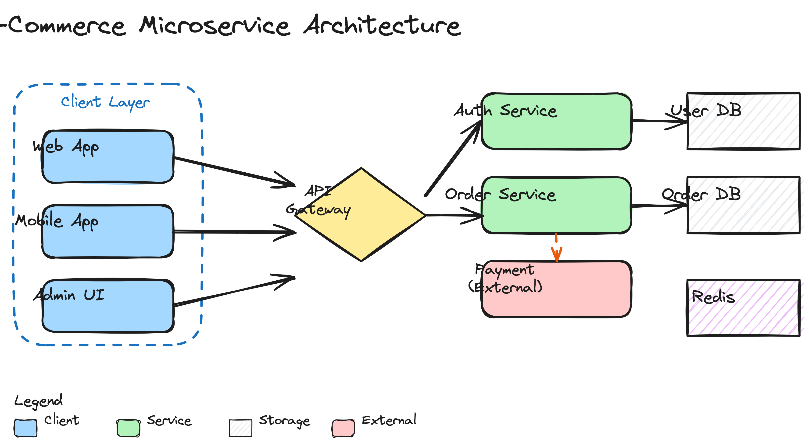

# excalidraw-skill

> 让你的 AI agent 画手绘风格的架构图、流程图、时序图，并导出 SVG / PNG。
> 用真正的 Excalidraw 引擎渲染，不是重实现。

[](#测试)
[](#license)

## 这是什么

一个 [agent skill](https://agentskills.io/)。装上之后，你的 coding agent（Claude Code / ZCode / OpenCode / Cursor 等几十种）就能：

1. 把你说的「画一个登录流程图」「给我看这个微服务架构」**生成为 Excalidraw scene JSON**。
2. 调用本 skill 的渲染脚本，**用官方 Excalidraw 引擎**把它渲染成图片。
3. 输出 **SVG（矢量，可拖回 excalidraw.com 编辑）+ PNG（位图，方便贴到聊天/文档）**。

下面这张图就是它自己渲染出来的 —— 一个电商微服务架构，40 个元素：



（想看矢量版？点 [`assets/architecture.svg`](assets/architecture.svg)，拖进 [excalidraw.com](https://excalidraw.com) 就能继续编辑。）

## 安装

**一行命令**，通过 [vercel-labs/skills](https://github.com/vercel-labs/skills) 的通用 skill 安装器（支持 70+ 种 agent）：

```bash
npx skills add <your-github-name>/excalidraw-skill
```

它会把 skill 复制到你当前项目的 agent skills 目录（Claude Code 是 `.claude/skills/`，ZCode 是 `.agents/skills/`，依此类推）。第一次渲染前装一下渲染依赖：

```bash
bash skills/excalidraw/scripts/install.sh
```

这会装 `playwright` 和 Chromium（~150MB，一次性）。**不需要 npm / node** —— Excalidraw 本身是在渲染时从 CDN 加载的。

## 用法

直接跟你的 agent 说人话：

```
> 画一个用户登录的流程图，手绘风格
> 帮我把这个支付系统的架构图画成 excalidraw
> 画一个时序图：客户端 → API → 数据库 → 缓存
```

agent 会生成 `.excalidraw` 文件，调用渲染脚本，吐出 `.svg` + `.png`。

**手动渲染（不走 agent 时）**：

```bash
python3 skills/excalidraw/scripts/render.py diagram.excalidraw
# → diagram.svg + diagram.png

# 只要 SVG
python3 skills/excalidraw/scripts/render.py diagram.excalidraw --format svg

# 高清 PNG
python3 skills/excalidraw/scripts/render.py diagram.excalidraw --scale 4
```

| 选项 | 作用 |
|------|------|
| `--format svg\|png\|both` | 输出格式，默认 `both` |
| `--output PATH` | 输出路径（不带扩展名，脚本自动加 `.svg`/`.png`） |
| `--scale N` | PNG 的 device scale factor，2 = retina（默认），SVG 永远矢量 |
| `--keep-seed` | 保留已有 seed，用于精确复现上一次渲染 |

## 它解决什么问题

市面上的 Excalidraw agent skill 有几个**致命毛病**，这个 skill 是来填坑的：

| 别人的问题 | 这个 skill 怎么办 |
|-----------|------------------|
| **seed 硬编码** —— 所有相同形状抖动一模一样，看着像盖戳，手绘的灵魂没了 | 渲染时**自动注入随机 seed**，每次抖动都不同，真·手绘感 |
| **只出 PNG** —— 丢掉矢量，放大糊，没法重新编辑 | **SVG + PNG 都出**；SVG 内嵌字体，可拖回 excalidraw.com 继续改 |
| **module 加载竞态** —— 标志位在 import 完成前就置位，首次渲染经常空白 | 用 promise 驱动的 `__excalDone` 布尔，**import 完成才置 true**，零竞态 |
| **调用签名踩坑** —— 位置参数在 Excalidraw 0.18 会静默返回空白画布 | 用**对象参数 + `restore()` + `convertToExcalidrawElements()`**，文本不再丢失 |
| **文案绑死品牌色 / 特定技术栈** —— 换个项目就得改 skill | 用 Excalidraw 默认调色板，**完全通用** |
| **Chromium 没装直接崩** | 检测到缺失 → 引导跑 `install.sh`，不让你猜 |

这些坑不是猜的 —— 是**实测踩出来的**：位置参数那一条，源码看着像位置参数，实际跑起来返回 40×40 空白，测了才知道要用对象参数。

## 怎么工作

```
.excalidraw (你/agent 写的 scene JSON)
        │
        ▼
render.py  ── 注入随机 seed（修复手绘死板）
        │
        ▼
headless Chromium  ── 加载 render_template.html
        │
        ▼
esm.sh CDN  ── 加载官方 @excalidraw/excalidraw@0.18.0
        │
        ▼
restore() + convertToExcalidrawElements()  ── 规范化 + 重算文本度量
        │
        ▼
exportToSvg({elements, appState, files})  ── 官方渲染引擎
        │
        ▼
SVG 字符串  ──→  .svg 文件
        │
        └──────→  svg 元素截图  ──→  .png 文件
```

关键设计决策（都写在代码注释里，不是黑箱）：

- **必须用 `?bundle`**：不 bundle，esm.sh 会发几十个级联请求，必然超时。
- **必须 `restore()` + `convertToExcalidrawElements()`**：手写的 scene JSON 缺字段，文本度量算不对，会被 exportToSvg 静默丢弃。这俩函数是官方的「从持久化数据恢复」路径。
- **必须对象参数**：`exportToSvg(elements, appState, files)` 在 0.18 会返回空白；`exportToSvg({elements, appState, files})` 才对。

## 测试

```bash
node test/render.test.mjs
```

11 个集成测试，覆盖：错误输入（坏 JSON / 缺 elements / 空数组）、三种输出格式、scale 分辨率、seed 随机化、stdout 契约。**fail-fast**，第一个失败就停，给你最可操作的报错。

```
Excalidraw render pipeline — integration tests

  PASS  rejects a non-existent input file
  PASS  rejects malformed JSON
  PASS  rejects a scene with no elements array
  PASS  rejects an empty elements array
  PASS  renders default (both SVG + PNG) from the example fixture
  PASS  produces an SVG with real content (not the empty 40x40 failure case)
  PASS  --format svg produces only SVG (no PNG)
  PASS  --format png produces only PNG (no SVG)
  PASS  --scale changes PNG file size (higher scale = larger file)
  PASS  randomizes seed each run (two renders differ)
  PASS  printed output is the file path(s)

11 passed, 0 failed.
```

## 仓库结构

```
excalidraw-skill/
├── skills/excalidraw/              # skill 本体（skills CLI 识别这个目录）
│   ├── SKILL.md                    # agent 读这个，知道何时用 + 怎么生成 scene
│   ├── scripts/
│   │   ├── render.py               # 渲染器（核心）
│   │   ├── render_template.html    # 浏览器模板（加载 Excalidraw，消除竞态）
│   │   └── install.sh              # 装依赖
│   └── references/
│       ├── element-templates.md    # 每种元素的 JSON 模板
│       └── examples/
│           ├── flowchart.excalidraw
│           └── microservice-architecture.excalidraw   # README 那张图的源文件
├── test/
│   └── render.test.mjs             # 集成测试
└── assets/                          # README 用的渲染产物
```

## 已知限制（不藏）

- **无自动布局** —— 元素坐标要你（或 agent）自己算。10 个元素以上会比较累，复杂图建议生成后拖进 excalidraw.com 微调。
- **渲染时需联网** —— Excalidraw 从 esm.sh CDN 加载（你选的「不优化依赖」路线，可接受）。
- **单文件渲染** —— 一次一张，不支持批量。
- **无重叠检测** —— 元素重叠了渲染会照实画出来，靠你自己 review。

## 参考

本 skill 的渲染架构参考了 [coleam00/excalidraw-diagram-skill](https://github.com/coleam00/excalidraw-diagram-skill)，并修复了它的 seed 硬编码、仅 PNG、module 竞态、文本丢失等问题。渲染用的是官方 [excalidraw/excalidraw](https://github.com/excalidraw/excalidraw) 的 `exportToSvg`。

## License

MIT
