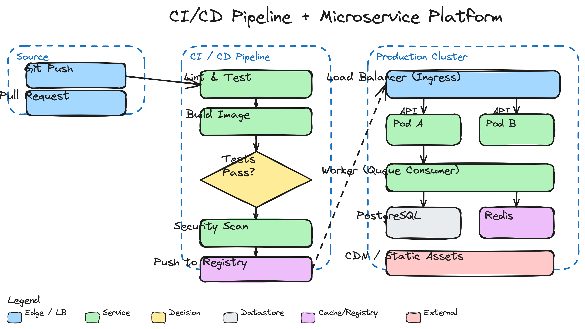

# excalidraw-skill

> 让 AI agent 画手绘风格的架构图、流程图、时序图，用真正的 Excalidraw 引擎渲染，导出 SVG + PNG。

[](#license)
[](#安装)

## 效果：画一张图长这样

下面这张 CI/CD 流水线 + 微服务架构图，是由 agent 说一句「画一个带 CI/CD 流水线的微服务架构」生成的，**59 个元素、3 个分组区域、决策节点、数据库、缓存、CDN**——全部用官方 Excalidraw 渲染，手绘风格：



想看矢量版？点 [`assets/diagram.svg`](assets/diagram.svg)，直接拖进 [excalidraw.com](https://excalidraw.com) 就能继续编辑、改色、挪位置。

## 它解决什么问题

让 AI agent **真正画出可用的架构图**，而不是只能描述。具体三件事：

1. **生成**：你用自然语言描述，agent 把它转成 Excalidraw scene JSON（矩形、椭圆、菱形、箭头、文本，带分组、配色、连接）。
2. **渲染**：调用真实 Excalidraw 引擎出图——手绘抖动、Virgil 手写字体、所有视觉细节和 excalidraw.com 里一模一样，不是任何重实现。
3. **导出**：同时输出 **SVG（矢量，拖回 excalidraw.com 可继续编辑）+ PNG（贴文档/聊天用）**。

## 安装

一行命令，通过 [vercel-labs/skills](https://github.com/vercel-labs/skills) 的通用 skill 安装器（支持 Claude Code、ZCode、OpenCode、Cursor 等 70+ 种 agent）：

```bash
npx skills add xiaoshuai1024/excalidraw-skill
```

它会把 skill 复制到你项目的 agent skills 目录（`.claude/skills/`、`.agents/skills/`、`.opencode/skills/` 等，按你用的 agent 自动适配）。

首次渲染前装一下渲染依赖（Playwright + Chromium，一次性）：

```bash
bash skills/excalidraw/scripts/install.sh
```

## 怎么用

### 方式一：跟 agent 说人话（推荐）

装好后直接对你的 coding agent 说：

```
> 画一个用户登录的流程图，手绘风格
> 把这个支付系统的架构画成 excalidraw
> 画一个时序图：客户端 → API → 数据库 → 缓存
> 我要一张电商下单的全链路架构图
```

agent 会自动生成 `.excalidraw` 文件、调用渲染脚本、吐出 `.svg` + `.png`。整个过程你不用碰 JSON。

### 方式二：手动渲染

已经有 `.excalidraw` 文件（从 excalidraw.com 导出的也行），直接渲染：

```bash
# 默认：同时出 SVG + PNG
python3 skills/excalidraw/scripts/render.py my-diagram.excalidraw
# → my-diagram.svg + my-diagram.png

# 只要矢量 SVG
python3 skills/excalidraw/scripts/render.py my-diagram.excalidraw --format svg

# 超高清 PNG（4x）
python3 skills/excalidraw/scripts/render.py my-diagram.excalidraw --scale 4

# 指定输出位置
python3 skills/excalidraw/scripts/render.py my-diagram.excalidraw -o docs/architecture
```

### 命令选项

| 选项 | 作用 |
|------|------|
| `--format svg\|png\|both` | 输出格式，默认 `both` |
| `--output PATH` | 输出路径（不带扩展名，自动加 `.svg`/`.png`） |
| `--scale N` | PNG 分辨率倍数，2 = retina（默认）；SVG 恒为矢量 |
| `--keep-seed` | 保留已有 seed，用于精确复现上一次渲染 |

## 适合画什么

| 图类型 | 示例 |
|--------|------|
| 系统架构图 | 微服务、组件关系、部署拓扑（上面的 CI/CD 图就是） |
| 流程图 | 业务流程、状态机、决策树 |
| 时序图 | 请求链路、跨服务调用 |
| ER 图 | 数据库表关系 |
| 线框图 | 简单的 UI 草图 |

颜色用 Excalidraw 默认调色板（蓝/绿/黄/红/紫/灰），按角色区分：边缘入口、服务、决策、数据存储、缓存、外部依赖。

## 它怎么工作

```
你（或 agent）写 .excalidraw scene JSON
        ↓
render.py 注入随机 seed（手绘抖动的来源）
        ↓
headless Chromium 加载官方 @excalidraw/excalidraw
        ↓
restore() + convertToExcalidrawElements() 规范化数据
        ↓
exportToSvg() —— 官方渲染引擎，出 SVG
        ↓
SVG 文件  +  SVG 截图为 PNG 文件
```

渲染用的是 Excalidraw 官方包的 `exportToSvg`，手绘抖动（rough.js）、Virgil 字体、配色全部是原版，和你在 excalidraw.com 里看到的一模一样。

## 仓库结构

```
excalidraw-skill/
├── skills/excalidraw/              # skill 本体
│   ├── SKILL.md                    # agent 读这个，知道何时用、怎么生成 scene
│   ├── scripts/
│   │   ├── render.py               # 渲染器（核心，跑这个）
│   │   ├── render_template.html    # 加载 Excalidraw 的浏览器模板
│   │   └── install.sh              # 装依赖
│   └── references/
│       ├── element-templates.md    # 每种元素的 JSON 模板
│       └── examples/
│           ├── flowchart.excalidraw             # 简单流程图示例
│           ├── cicd-microservice.excalidraw     # README 那张复杂图的源文件
│           └── build-demo.py                    # 复杂图的生成脚本（参考）
└── assets/diagram.{svg,png}        # README 展示用的渲染产物
```

## 致谢

渲染架构参考了 [coleam00/excalidraw-diagram-skill](https://github.com/coleam00/excalidraw-diagram-skill)，渲染引擎用的是官方 [excalidraw/excalidraw](https://github.com/excalidraw/excalidraw)。skill 安装走 [vercel-labs/skills](https://github.com/vercel-labs/skills) 生态。

## License

MIT
