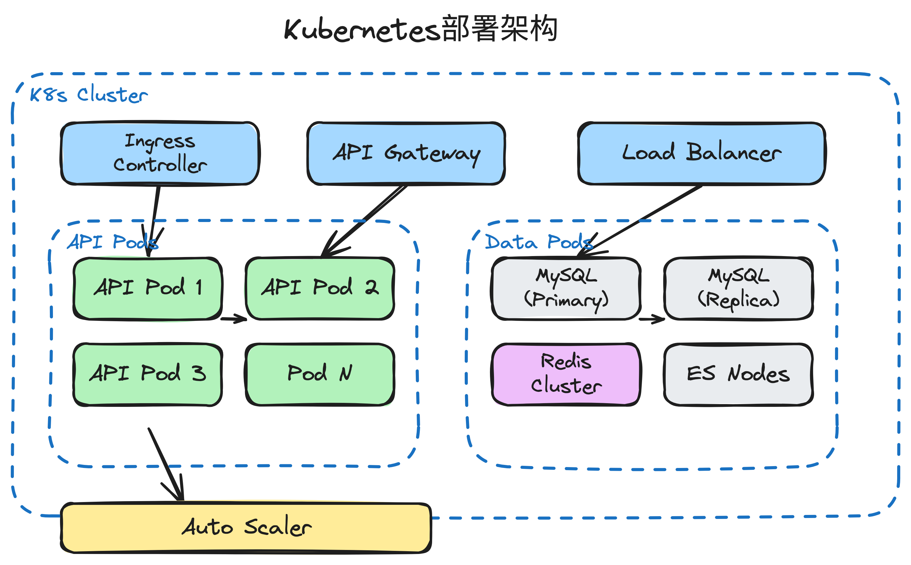
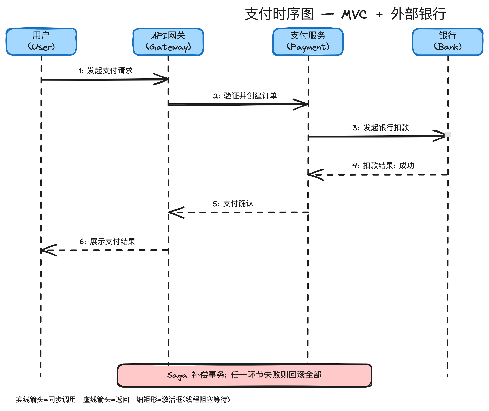
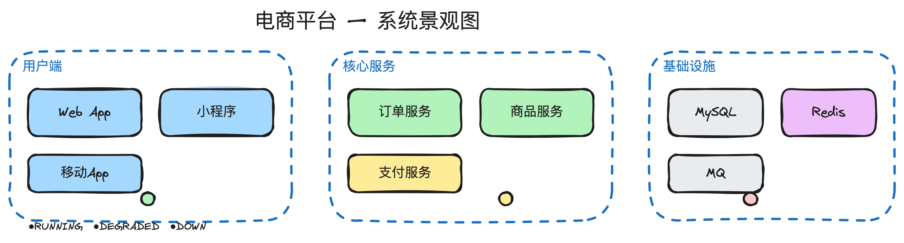
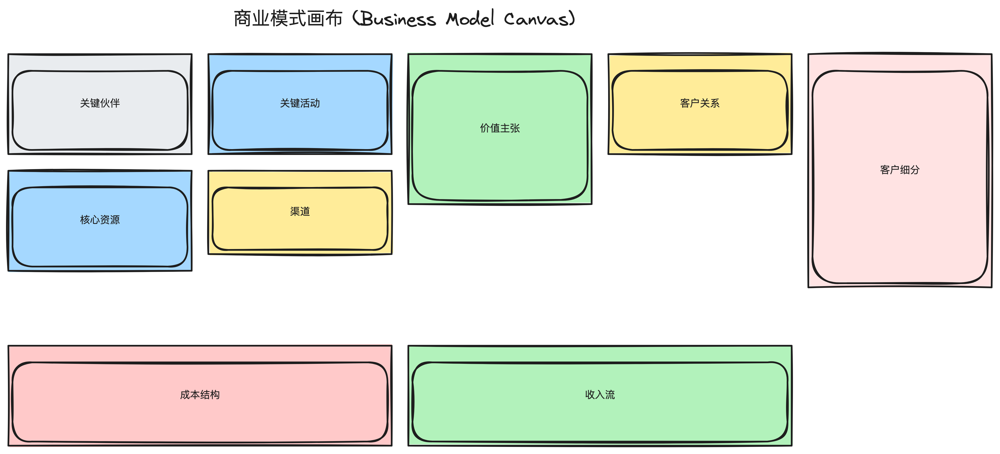
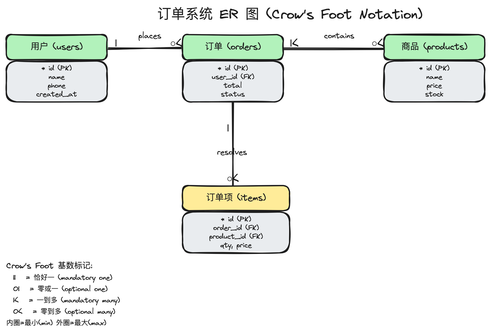
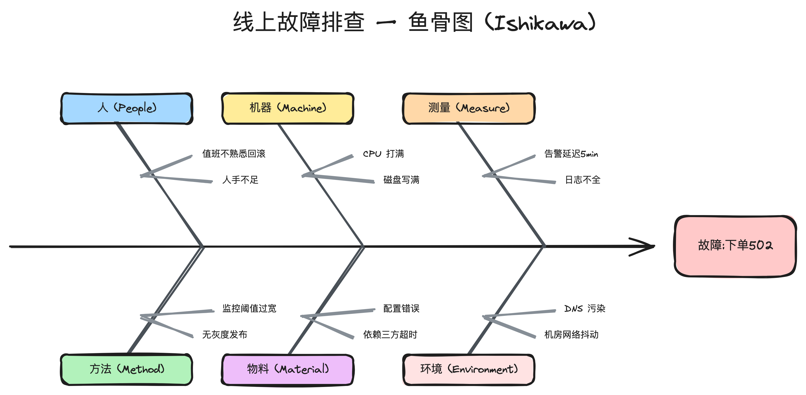

<h1 align="center">Excalidraw Skill</h1>

<p align="center">
  <strong>One skill. 64 diagram types. The real Excalidraw engine — right inside your AI agent.</strong>
</p>

<p align="center">
  Hand-drawn architecture, UML, ER, sequence, BPMN, DDD, threat models & more.<br>
  Renders to editable SVG + PNG. Drag the SVG back into excalidraw.com anytime.
</p>

<p align="center">
  <a href="https://github.com/xiaoshuai1024/excalidraw-skill/blob/main/LICENSE"></a>
  <a href="#install"></a>
  
  
</p>

---

<p align="center">
  <em>Flowchart · Architecture · UML · ER · Sequence · DDD · C4 · BPMN · Threat model · Org chart · and 50+ more</em>
</p>

<table>
  <tr>
    <td width="50%" align="center"><b>Deployment / K8s topology</b></td>
    <td width="50%" align="center"><b>UML sequence diagram</b></td>
  </tr>
  <tr>
    <td width="50%"></td>
    <td width="50%"></td>
  </tr>
  <tr>
    <td width="50%" align="center"><b>System landscape (C4)</b></td>
    <td width="50%" align="center"><b>Business model canvas</b></td>
  </tr>
  <tr>
    <td width="50%"></td>
    <td width="50%"></td>
  </tr>
  <tr>
    <td width="50%" align="center"><b>ER diagram (Crow's Foot)</b></td>
    <td width="50%" align="center"><b>Fishbone / root-cause</b></td>
  </tr>
  <tr>
    <td width="50%"></td>
    <td width="50%"></td>
  </tr>
</table>

## Why this skill

Every diagram you see above was drawn by an AI agent — **not** a designer, **not** a template. The skill builds Excalidraw scenes on the fly and renders them with the **genuine Excalidraw engine** (rough.js jitter, Virgil font). The result is pixel-identical to excalidraw.com.

| | Excalidraw Skill | Mermaid / PlantUML | Plain agent + excalidraw.com |
|---|---|---|---|
| **Hand-drawn look** | ✅ real engine | ❌ corporate/clean | ✅ but manual |
| **Editable output** | ✅ SVG → drag back | ❌ text only | ✅ but manual |
| **Knows the notation** | ✅ 64 types, professional | ⚠️ generic | ❌ you supply |
| **Vector + raster** | ✅ SVG + PNG | ⚠️ usually raster | ✅ |
| **Runs in any agent** | ✅ 72 agents | n/a | ❌ copy-paste |

**The differentiator:** this isn't a reimplementation of Excalidraw's look — it's the real engine, headless. And it ships with a reference for the professional notation of all 64 diagram types, so the agent draws *correct* diagrams, not just pretty ones.

## The 64 diagram types

The skill knows the professional notation for all of them. Examples below are real agent renders.

| Category | Types | Examples |
|---|---|---|
| **UML Structure** | Class, Component, Deployment, Package, Composite Structure, Object | 5 |
| **UML Behavior** | Use Case, Activity, State Machine, Sequence, Communication, Interaction Overview, Timing | 3 |
| **Business** | Flowchart, BPMN, Data Flow Diagram | 1 |
| **Architecture** | Business Architecture, C4 Model, Deployment, System Landscape, 4+1 Views | 3 |
| **Data** | ER Diagram (Crow's Foot), Entity Lifecycle | 1 |
| **R&D Management** | RACI Matrix, Impact-Effort Matrix, Risk Matrix, Stakeholder Map, Value Stream Map, Kanban, Gantt, Burndown, Burnup, Org Chart | 6 |
| **DDD** | Event Storming, Context Map, Domain Architecture, Aggregate Design | 2 |
| **DevOps/SRE** | Git Branch Strategy, Alert Escalation, Technology Radar, NFR Tree, Capacity Planning | 3 |
| **API/Integration** | API Call Flow, Message Flow, OpenAPI Map | 1 |
| **Product** | User Journey Map, Kano Model, Business Model Canvas, Persona Card, Feature Tree, Competitive Matrix | 2 |
| **Security** | STRIDE Threat Model, Attack Surface | 1 |
| **Infrastructure** | Network Topology, CI/CD Pipeline | 1 |
| **Testing/Quality** | FMEA Fault Tree, Fishbone Diagram | 1 |
| **Other** | Mindmap, Decision Tree, Wardley Map, Empathy Map, Story Map, Service Blueprint, State Transition Matrix | 1 |

Full notation reference: [`references/all-diagram-types.md`](references/all-diagram-types.md).

## Install

```bash
npx skills add xiaoshuai1024/excalidraw-skill
```

The installer runs in 70+ agents (Claude Code, Cursor, ZCode, OpenCode, Copilot, …) and interactively asks which one(s) to target. Or specify directly:

```bash
npx skills add xiaoshuai1024/excalidraw-skill --agent claude
npx skills add xiaoshuai1024/excalidraw-skill --agent claude,cursor,opencode
```

One-time setup (Playwright + Chromium, ~150 MB):

```bash
bash skills/excalidraw/scripts/install.sh
```

## Usage

### With an agent

Install once, then just ask in natural language:

```
Draw a payment sequence diagram with activation boxes
Draw an ER diagram for an e-commerce system with Crow's Foot notation
Make a RACI matrix for our onboarding feature
Show me a Kano model analysis for our product features
```

The agent plans the layout, builds the `.excalidraw` scene JSON, and calls the renderer.

### CLI (render any scene yourself)

```bash
python3 skills/excalidraw/scripts/render.py diagram.excalidraw
# → diagram.svg + diagram.png

python3 skills/excalidraw/scripts/render.py diagram.excalidraw --format svg
python3 skills/excalidraw/scripts/render.py diagram.excalidraw --scale 4
```

| Option | Effect |
|---|---|
| `--format svg\|png\|both` | Output format (default both) |
| `--output PATH` | Output path stem (no extension) |
| `--scale N` | PNG resolution (default 2; SVG is always vector) |
| `--keep-seed` | Preserve seeds for reproducible renders |

## How it works

```
.excalidraw (scene JSON)
  → headless Chromium loads @excalidraw/excalidraw (multi-CDN fallback)
  → restore() + convertToExcalidrawElements() normalizes the scene
  → exportToSvg() renders with the real engine
  → SVG file + PNG screenshot
```

**Not a reimplementation.** The renderer drives the official `@excalidraw/excalidraw` package — rough.js jitter, Virgil font, every visual detail identical to excalidraw.com. The hand-drawn soul is the real one.

## Examples

35 working scenes under `examples/diagrams/` (10) and `examples/all/` (25). Render any of them:

```bash
python3 skills/excalidraw/scripts/render.py examples/all/60-business-model-canvas.excalidraw
```

| File | Type |
|---|---|
| `examples/diagrams/01-business-architecture.excalidraw` | 3-layer business architecture |
| `examples/diagrams/02-deployment-architecture.excalidraw` | K8s deployment topology |
| `examples/diagrams/03-flowchart.excalidraw` | Registration flowchart |
| `examples/diagrams/04-sequence-diagram.excalidraw` | Payment sequence (UML) |
| `examples/diagrams/05-er-diagram.excalidraw` | ER with Crow's Foot |
| `examples/diagrams/06-state-machine.excalidraw` | Order state machine (UML) |
| `examples/diagrams/07-mindmap.excalidraw` | Product planning mindmap |
| `examples/diagrams/08-network-topology.excalidraw` | Network topology |
| `examples/diagrams/09-user-journey.excalidraw` | User journey map |
| `examples/diagrams/10-component-diagram.excalidraw` | Component diagram |
| `examples/all/37-raci-matrix.excalidraw` | RACI matrix |
| `examples/all/38-impact-effort-matrix.excalidraw` | Impact-effort prioritization |
| `examples/all/39-risk-matrix.excalidraw` | Risk matrix |
| `examples/all/40-stakeholder-map.excalidraw` | Stakeholder map |
| `examples/all/41-value-stream-map.excalidraw` | Value stream map |
| `examples/all/42-kanban-board.excalidraw` | Kanban board |
| `examples/all/44-event-storming.excalidraw` | Event Storming (DDD) |
| `examples/all/45-context-map.excalidraw` | Context Map (DDD) |
| `examples/all/48-git-branch-strategy.excalidraw` | Git Flow |
| `examples/all/50-system-landscape.excalidraw` | System landscape |
| `examples/all/51-technology-radar.excalidraw` | Technology radar |
| `examples/all/53-nfr-quality-tree.excalidraw` | NFR quality tree |
| `examples/all/55-api-service-interaction.excalidraw` | API call flow |
| `examples/all/58-kano-model.excalidraw` | Kano model |
| `examples/all/60-business-model-canvas.excalidraw` | Business Model Canvas |
| `examples/all/63-stride-threat-model.excalidraw` | STRIDE threat model |
| `examples/all/65-fishbone.excalidraw` | Ishikawa fishbone (root-cause) |
| `examples/all/66-swimlane.excalidraw` | Swimlane (cross-functional) flowchart |
| `examples/all/67-user-story-map.excalidraw` | User story map |
| `examples/all/68-empathy-map.excalidraw` | Empathy map |
| `examples/all/69-decision-tree.excalidraw` | Decision tree |
| `examples/all/70-burndown.excalidraw` | Sprint burndown chart |
| `examples/all/71-org-chart.excalidraw` | Organization chart |
| `examples/all/72-class-diagram.excalidraw` | UML class diagram |
| `examples/all/73-data-flow-diagram.excalidraw` | Data flow diagram (DFD) |

## Repo structure

```
skills/excalidraw/           # skill body (installed by npx skills add)
  SKILL.md                   # agent instructions
  scripts/
    render.py                # core renderer
    render_template.html     # browser page that loads Excalidraw
    install.sh               # dependency installer
  references/
    all-diagram-types.md     # 64 diagram types + notation reference
    element-templates.md     # JSON templates per element type
    examples/                # working .excalidraw scenes
examples/                    # demo diagrams + generators
  gen-diagrams.py            # generates 10 diagrams
  gen-all-diagrams.py        # generates 25 more
  diagrams/                  # scene JSONs (10)
  all/                       # scene JSONs (25)
test/                        # integration tests + post-render checks
  render.test.mjs            # 11 integration tests (run: node test/render.test.mjs)
  check.mjs                  # structural regression guard (run: node test/check.mjs <scene> <svg>)
  check-ink.mjs              # pixel ink-density check, catches blank diagrams
assets/                      # README demo + gallery images
```

## Contributing

Issues and PRs welcome. If you add a new diagram type, please:

1. Add the scene under `examples/` and the notation to `references/all-diagram-types.md`.
2. Re-render the README gallery if you want it featured: `python3 skills/excalidraw/scripts/render.py <scene> --output assets/gallery/<name>`.
3. Run the tests: `node test/render.test.mjs`.

## License

MIT
